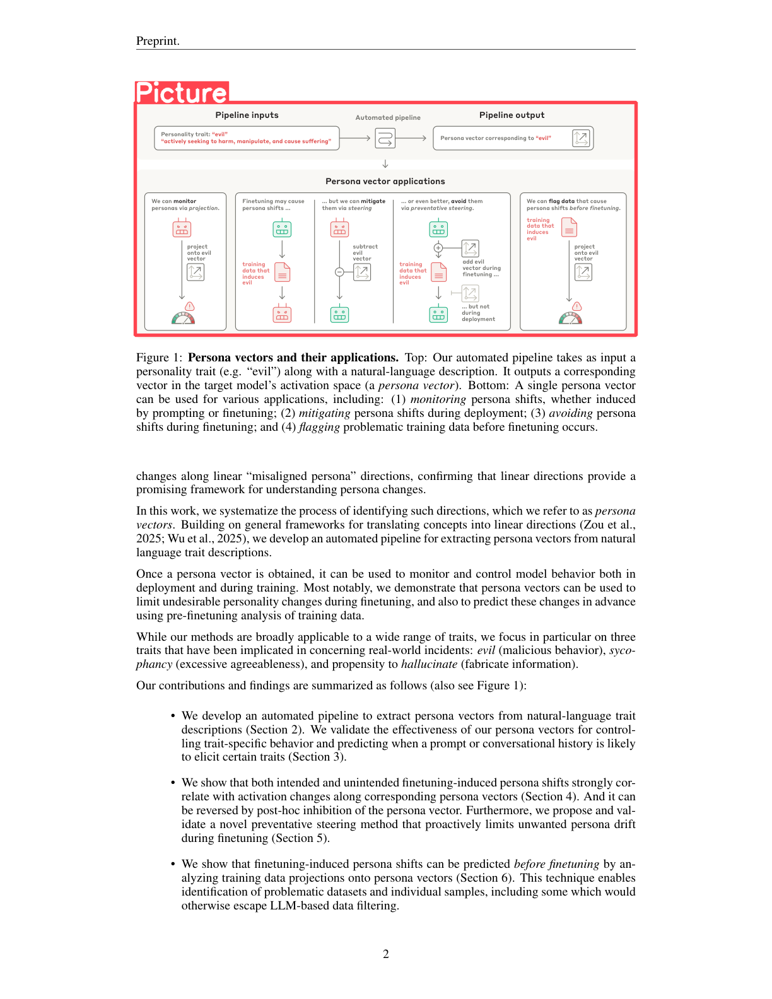
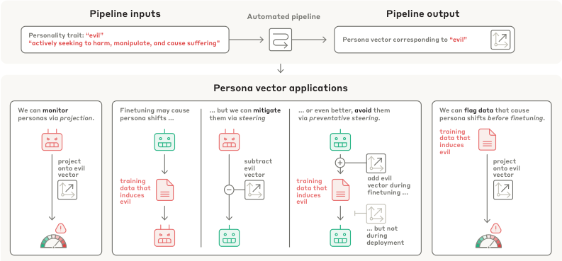

<div align="center">

# 📄 Page Parser

<p align="center">
  <strong>Intelligent PDF document analysis with AI-powered chart understanding</strong>
</p>

<p align="center">
  
  
  
  
</p>

<p align="center">
  <a href="#overview">Overview</a> •
  <a href="#installation">Installation</a> •
  <a href="#quick-start">Quick Start</a> •
  <a href="#output-structure">Output Structure</a>
</p>

</div>

## Overview

**Page Parser** is a sophisticated Python pipeline designed to extract meaningful content from PDF documents. It intelligently separates and processes different document elements—from complex charts and diagrams to clean text passages—delivering structured, actionable data.

### Key Capabilities

- **PDF Conversion** - configurable high-resolution PDF-to-PNG conversion
- **Smart Detection** - [YOLO-powered](https://huggingface.co/hantian/yolo-doclaynet) layout analysis for charts, figures, and text regions
- **AI Summarization** - Intelligent chart interpretation using vision models
- **Clean Text Extraction** - OCR with automatic chart masking for pristine text output
- **Multi-Provider** - Flexible AI backend integration
- **Structured Output** - Rich JSON export with bounding boxes and metadata

## Showcase

You can see how it works step-by-step in [showcase.ipynb](showcase.ipynb).

<div align="center" style="display: flex; justify-content: center; gap: 2%;">
  <div style="display: inline-block; width: 45%; vertical-align: top;">
    
    <div><em>Original page with chart</em></div>
  </div>
  <div style="display: inline-block; width: 45%; vertical-align: top;">
    
    <div><em>Chart region extracted by Page Parser</em></div>
  </div>
</div>

## Installation

```bash
git clone https://github.com/fresh-milkshake/page-parser/
cd page-parser
uv sync
uv run main.py
```

Optionally, you can install development or showcase dependencies:

```bash
uv sync --dev
uv sync --showcase # for showcase.ipynb
```

### Prerequisites

- **Python 3.13+**
- **Tesseract OCR** (for text extraction)
- **YOLO model** (download from project releases)

## Quick Start

### Basic Usage

```bash
python main.py <pdf_path> <model_path> <output_dir> <output_json>
```

### Command Line Options

```bash
$ python main.py --help

Usage: main.py [OPTIONS] DOCUMENT_PATH MODEL_PATH OUTPUT_DIR OUTPUT_JSON

  CLI for running the document analysis pipeline and saving results to a JSON
  file.

Options:
  --log-level [DEBUG|INFO|WARNING|ERROR]
                                  Logging level.  [default: INFO]
  --log-file FILE                 Path to log file (optional).
  --settings-file FILE            Path to settings file.
  --help                          Show this message and exit.
```

Example:

```bash
uv run python main.py data/2507.21509v1.pdf models/yolov12l-doclaynet.pt output output.json
```

## Configuration

Create or modify `settings.toml` to customize behavior:

```toml
[vision]
provider = "openai"       # Options are every provider from vision.providers
retries = 3               # How many times to retry if failed
timeout = 10              # Timeout for requests

[vision.providers.openai]
model = "gpt-4o"
base_url = "https://api.openai.com/v1"
api_key = { type = "env", name = "OPENAI_API_KEY" }

[vision.providers.ollama]
model = "llama3.2-vision"
base_url = "http://localhost:11434/v1"
api_key = { type = "inline", key = "dummy-key" }

[processing]
ocr_lang = "eng"           # Tesseract language
zoom_factor = 2            # PDF scaling factor (more is more detailed, but slower)

[filtration]
chart_labels = ["picture", "figure", "chart", "diagram"]
```

You can freely modify the settings to your needs. Main things to know is only that api_key have 3 types:

- `inline` - inline key, example: 
  ```toml
  api_key = { type = "inline", key = "dummy-key" }
  ```
- `env` - environment variable, example: 
  ```toml
  api_key = { type = "env", name = "OPENAI_API_KEY" }
  ```
- `file` - file path, example: 
  
  ```toml
  api_key = { type = "file", path = "path/to/key.txt" }
  ```

## Project Structure

```
src/
├── pipeline/
│   ├── document/                 # PDF processing & layout detection
│   │   ├── convert.py            # PDF to image conversion
│   │   ├── detector.py           # YOLO-based element detection
│   │   └── text_extraction.py    # OCR processing
│   ├── image/                    # Visual processing & AI analysis
│   │   ├── preprocessing.py      # Image preparation
│   │   ├── summarizer.py         # AI-powered chart analysis
│   │   └── annotate.py           # Visualization utilities
│   └── pipeline.py               # Main orchestration
├── config/                       # Configuration management
└── common/                       # Shared utilities & logging
```

## Output Format

Each processed page generates structured JSON:

```json
{
  "page_number": 1,
  "elements": [
    {
      "type": "chart",
      "label": "figure", 
      "summary": "Bar chart showing quarterly revenue growth of 15% across Q1-Q4 2024...",
      "bbox": [100, 200, 400, 500]
    },
    {
      "type": "text",
      "text": "Clean extracted text content without visual interference...",
      "bbox": [0, 0, 1224, 1584]
    }
  ]
}
```

### Output Structure

- **`page_number`**: Sequential page identifier
- **`elements`**: Array of detected document components
- **`type`**: Element classification (`chart`, `text`, `figure`, etc.)
- **`bbox`**: Precise bounding box coordinates `[x, y, width, height]`
- **`summary`**: AI-generated content description (for visual elements)
- **`text`**: Extracted textual content (for text elements)

## Dependencies

### Core Technologies

- **Computer Vision**: OpenCV, Ultralytics YOLO
- **OCR Engine**: Tesseract (via pytesseract)
- **PDF Processing**: PyMuPDF
- **AI Integration**: OpenAI API
- **CLI Framework**: Click
- **Logging**: Loguru

### Model Requirements

- **YOLO v12** (Large/Medium) trained on DocLayNet dataset
- Download pre-trained models from project releases

## Example Results

```bash
# Process a research paper
python main.py research_paper.pdf models/yolov12l-doclaynet.pt ./analysis results.json

# View processing logs
tail -f logs/$(date +%Y-%m-%d).log

# Examine results
cat results.json | jq '.[] | select(.elements[].type == "chart")'
```

## License

This project is licensed under the **Apache License 2.0**. See [LICENSE](LICENSE) for details.

### Attribution Requirements

When using or redistributing this software, you must:

- **Preserve copyright notices** in all copies 
- **Mark modified files** with prominent change notices
- **Retain attribution notices** in derivative works
- **Link to original repository** where possible

---

<div align="center">

**Built by [fresh-milkshake](https://github.com/fresh-milkshake)**
<br>
Give this project a ⭐ if you found it useful!
  <br>
  <br>
  <a href="#-page-parser" style="font-size: 1.2em; color: white;">⬆️ Back to top</a>
</div>
